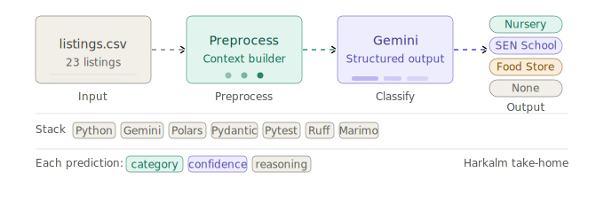
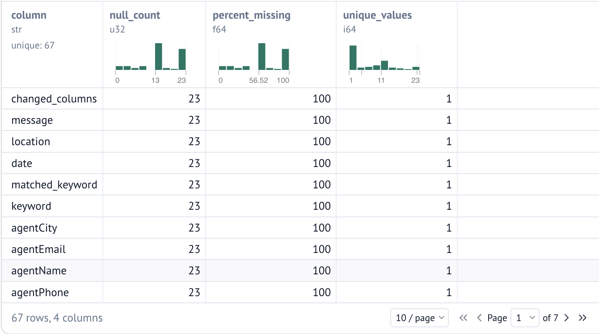
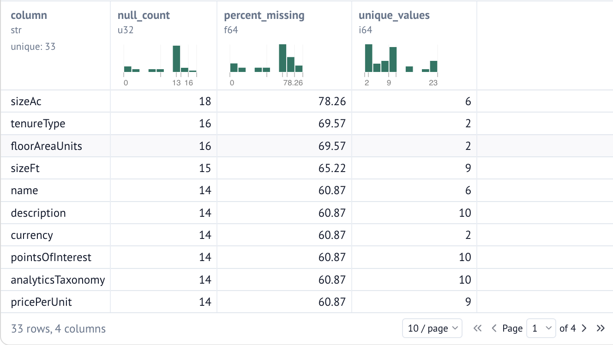
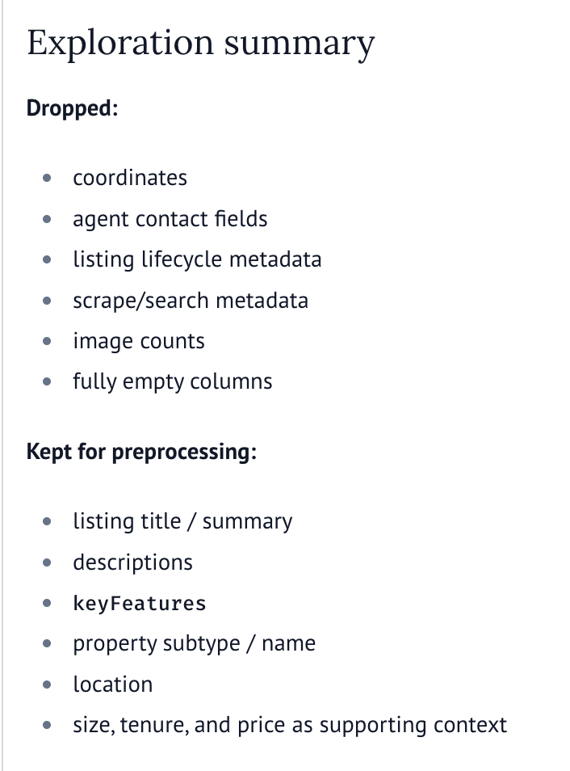
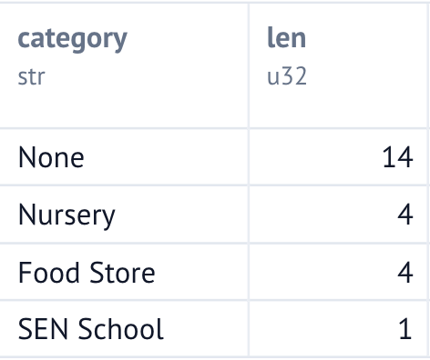

<div align="center">

# Property Classifier

An LLM-powered pipeline for classifying commercial property listings into structured categories using preprocessing, prompt engineering, and structured outputs.


</div>

---



## Overview

Commercial property listings often contain a mixture of useful information, duplicated descriptions, agent metadata, and scrape-specific fields.

Rather than passing the raw dataset directly to a language model, this project first explores and preprocesses the data to construct a concise, high-signal representation of each listing before classification.

Each property is classified into one of four categories:

- 🏫 Nursery
- 🎓 SEN School
- 🛒 Food Store
- ⭕ None

Every prediction includes:

- category
- confidence
- reasoning

---

## Pipeline

```text
                  listings.csv
                       │
                       ▼
           Data Exploration (Marimo)
                       │
                       ▼
               Feature Selection
                       │
                       ▼
             Listing Preprocessing
                       │
                       ▼
         Structured Prompt Construction
                       │
                       ▼
             Gemini Structured Output
                       │
                       ▼
          Pydantic Validation & Parsing
                       │
                       ▼
             classified_listings.csv
```

---

## Repository Structure

```text
property-classifier/
│
├── data/
│   └── listings.csv
│
├── notebooks/
│   └── data_exploration.py
│
├── output/
│   └── classified_listings.csv
│
├── src/
│   ├── classifier.py
│   ├── config.py
│   ├── file_io.py
│   ├── main.py
│   ├── models.py
│   ├── preprocessing.py
│   └── prompts.py
│
├── tests/
│   ├── test_classifier.py
│   ├── test_preprocessing.py
│
├── assets/
│   ├── hero.svg
│   ├── marimo_column_profile.png
│   ├── marimo_candidate_profile.png
│   ├── exploration_summary.png
│   ├── results.png
│
├── README.md
│
└── pyproject.toml
```

---

## Design

The implementation is intentionally split into small, single-purpose modules.

| Module             | Responsibility                            |
| ------------------ | ----------------------------------------- |
| `file_io.py`       | Read and write CSV data                   |
| `preprocessing.py` | Clean listings and construct LLM context  |
| `prompts.py`       | Prompt templates                          |
| `classifier.py`    | Gemini interaction and structured parsing |
| `models.py`        | Shared Pydantic models                    |
| `main.py`          | Pipeline orchestration                    |

This separation keeps preprocessing, prompting, classification, and I/O independent, making the pipeline easier to reason about and test.

---

## Data Exploration

Before implementing the classifier, the dataset was explored using **Marimo**.

The exploration focused on:

- profiling missing values
- identifying duplicate information
- removing scrape-specific metadata
- selecting high-signal fields
- determining which attributes should be included in the final LLM context

Only the selected property-level information is passed to the model.

To explore the notebook interactively:

```bash
marimo edit notebooks/data_exploration.py
```

### Column Profile

<p align="center">
  
</p>

### Candidate Profile

<p align="center">
  
</p>

<p align="center">
  
</p>

---

## Preprocessing

Each listing is converted into a structured context before being sent to the language model.

Example:

```text
Page title:
Former Children's Nursery

Summary:
Purpose-built childcare facility...

Key features:
• Outdoor play area
• Reception
• Classrooms

Property subtype:
Commercial Property
```

Rather than forwarding every CSV column, the preprocessing stage intentionally filters the dataset to include only fields that contribute meaningful classification signal.

---

## Running the Project

Create a virtual environment.

```bash
python3 -m venv .venv
source .venv/bin/activate
```

Install the project.

```bash
pip install -e ".[dev]"
```

Create a `.env` file.

```text
GEMINI_API_KEY=your_api_key
```

Run the pipeline.

```bash
python -m src.main
```

The classified listings will be written to:

```text
data/classified_listings.csv
```

---

## Running Tests

Run the complete test suite.

```bash
python -m pytest
```

Current coverage includes preprocessing, parsing, formatting, and classifier orchestration.

---

## Evaluation

After generating `data/classified_listings.csv`, predictions can be reviewed in an interactive Marimo notebook.

```bash
marimo edit notebooks/evaluation.py
```

<p align="center">
  
</p>

---

## Future Improvements

Potential production enhancements include:

- batched or parallel LLM requests
- retry logic with exponential backoff
- evaluation against labelled datasets
- confidence calibration
- provider abstraction for multiple LLM backends
- observability and request tracing

---

## Technologies

- Python
- Gemini Structured Output
- Polars
- Pydantic
- Marimo
- Pytest
- Ruff

```

```
